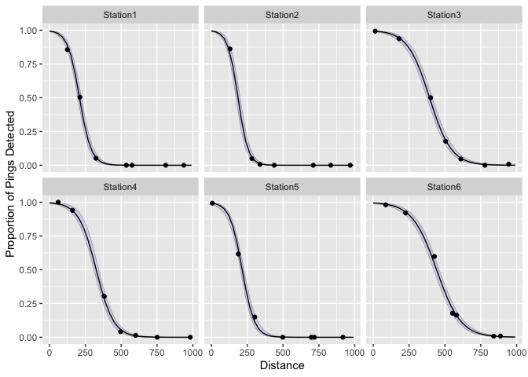

<!-- README.md is generated from README.Rmd. Please edit that file -->

# detrange

##### \*\*\* Please note that this package is still experimental. The API may change in the future. Feel free to drop some issues with questions/bugs/ideas/feedback! \*\*\*

## Installation

To use `detrange`, you must have JAGS installed on your system. Go to
<http://mcmc-jags.sourceforge.net> for instructions. On a mac, you can
also install JAGS from homebrew with `brew install jags`.

Once JAGS is installed, install the development version of `detrange`
from [GitHub](https://github.com/) with:

``` r
# install.packages("devtools")
devtools::install_github("Freshwater-Fish-Ecology-Laboratory/detrange")
```

## Introduction

#### Detection Range and Detection Efficiency

`detrange` estimates detection range (DR) from multiple stations within
a passive acoustic telemetry array using range testing data collected in
the field. DR is defined by Kessel et al. (2014) as

> “… the relationship between detection probability and the distance
> between the receiver and tag…presented graphically in the form of a
> logistic curve of detection probability.”

Given a modeled DR, it is possible to estimate the distance at which a
target detection efficiency (DE) occurs. DE is defined by Brownscombe et
al (2019) as

> “\[t\]he number of acoustic transmitter detections effectively logged
> by an acoustic receiver in a given time period, expressed as a
> percentage (or proportion) of total potential detections based on
> transmission rate.”

Following recommendations from Brownscombe et al (2019) and Huveneers et
al. (2016), it can be useful to estimate the distance at which a target
level of DE occurs (i.e. midpoint of DR at 50% DE), e.g. to place
sentinel tags at a sample of receivers to measure variation in DE over
time.

#### The modelling approach

Under the hood, `detrange` uses JAGS software and the
[rjags](https://cran.r-project.org/web/packages/rjags/rjags.pdf) R
package to implement a Bayesian generalized linear model with logit link
and binomial response distribution. The user may choose to fit a
generalized linear mixed-effects model with random slope and/or random
intercept for each Station. Otherwise, Station is treated as a fixed
effect.

A benefit of using a Bayesian approach is that uncertainty can be
quantified for estimates of the distance at which a specified DE occurs.
Another benefit is the ability to incorporate prior information. By
default, the priors used in the model are non-informative. However, the
user may set custom priors, e.g., if prior information about realistic
detection range in a given system is known or if data are limited.

## Demonstration

### Data

`detrange` expects data typical of detection range testing. Mandatory
columns include:

-   `station` (character or factor)  
-   `distance` (numeric)  
-   `detects` (whole numeric)  
-   `pings` (whole numeric)

`pings` is the expected number of detections and `detects` is the
observed number of detections over the duration of the range testing
time period at a given distance. An example dataset `range_test` is
included for reference.

``` r
library(detrange)
detrange::range_obs
#>          station distance pings detects depth_receiver depth_tag
#> 1   Border Right      100    90      70            3.0       7.0
#> 2   Border Right      200    96       0            3.0       3.6
#> 3   Border Right      300    78      10            3.0       1.8
#> 4   Border Right      400    90       0            3.0       9.4
#> 5        Genelle      100    78      68            2.3       7.4
#> 6        Genelle      250    78       7            2.3       5.1
#> 7        Genelle      400    84       7            2.3       5.4
#> 8      Glenmarry      100    84      79            2.7       6.0
#> 9      Glenmarry      250    84       0            2.7       7.6
#> 10     Glenmarry      450    84       0            2.7       7.6
#> 11     Glenmarry      750   114       0            2.7      10.1
#> 12      Kinnaird      100    84      64            2.4       9.4
#> 13      Kinnaird      250    78      50            2.4       6.8
#> 14      Kinnaird      450    84      11            2.4       9.6
#> 15      Kinnaird      750    78      14            2.4       5.5
#> 16      Kootenay      100   120     105            2.3      10.0
#> 17      Kootenay      250    90      16            2.3      10.1
#> 18      Kootenay      450    78       0            2.3      10.7
#> 19      Kootenay      550    84       0            2.3       3.7
#> 20 Trail Airport      100    84      41            2.3       4.6
#> 21 Trail Airport      250    84       3            2.3       8.0
#> 22 Trail Airport      450    78       0            2.3       8.7
#> 23 Trail Airport      750   240       0            2.3       4.6
```

### Analysis

Fit a model

``` r
# adjust the `nthin` argument to improve convergence.
fit <- dr_fit(detrange::range_obs)
#> Registered S3 method overwritten by 'mcmcr':
#>   method               from 
#>   as.mcmc.list.mcarray rjags
```

A number of generic methods are defined for the output object of
`dr_fit()`, including `autoplot` `glance`, `tidy`, `coef`, `augment`,
`summary`, `estimates`, and `predict`.

``` r
glance(fit)
#> # A tibble: 1 × 8
#>       n     K nchains niters nthin   ess  rhat converged
#>   <dbl> <int>   <int>  <int> <dbl> <int> <dbl> <lgl>    
#> 1    23     6       3   1000    10   210  1.05 FALSE
```

``` r
tidy(fit, conf_level = 0.89)
#> # A tibble: 4 × 6
#>   term              estimate    lower   upper svalue description                
#>   <term>               <dbl>    <dbl>   <dbl>  <dbl> <chr>                      
#> 1 bDistance          -0.0231 -0.0342  -0.0113   6.12 Effect of distance on logi…
#> 2 bIntercept          3.57    1.81     5.35     5.62 Intercept of logit(`eDetec…
#> 3 sDistanceStation    0.0155  0.00937  0.0320  11.6  Standard deviation of `bDi…
#> 4 sInterceptStation   2.26    1.28     4.72    11.6  Standard deviation of `bIn…
```

Plot predicted detection range

``` r
autoplot(fit)
```

<!-- -->

Predict distance(s) at target levels of detection efficiency

``` r
predicted_dist <- dr_predict_distance(fit, de = c(0.5, 0.8))
head(predicted_dist)
#>        Station  de  estimate     lower     upper   svalue
#> 1 Border Right 0.5 133.73957 118.27801 148.12319 11.55123
#> 7 Border Right 0.8  74.04273  47.62251  93.48811 11.55123
#> 2      Genelle 0.5 180.69737 159.64310 200.26617 11.55123
#> 8      Genelle 0.8 104.30744  70.45081 128.49005 11.55123
#> 3    Glenmarry 0.5 155.70971 140.58795 173.97181 11.55123
#> 9    Glenmarry 0.8 124.23611 108.99620 143.33763 11.55123
```

### How to do more

The output of `dr_fit()` is a list with 3 elements:  
1. `fit$model` - the model object of class `jags` created by
`rjags::jags.model()`  
1. `fit$samples` - the MCMC samples generated
from`rjags::jags.samples()` converted to `mcmcr` class  
1. `fit$data` - the detection range data provided

These are the raw materials for any further exploration or analysis. For
example, view trace and density plots with `plot(fit$samples)`.

See [mcmcr](https://github.com/poissonconsulting/mcmcr) and
[mcmcderive](https://github.com/poissonconsulting/mcmcderive) for
working with `mcmcr` objects, or convert samples to an object of class
`mcmc.list`, e,g, with `coda::as.mcmc.list` for working with the
[coda](https://github.com/cran/coda) R package.

## Code of Conduct

Please note that the detrange project is released with a [Contributor
Code of
Conduct](https://contributor-covenant.org/version/2/0/CODE_OF_CONDUCT.html).
By contributing to this project, you agree to abide by its terms.
