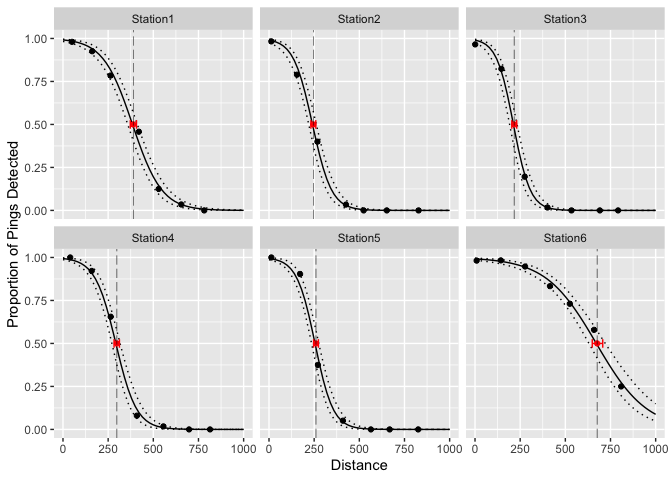

<!-- README.md is generated from README.Rmd. Please edit that file -->

# detrange

## Introduction

#### Detection Range and Detection Efficiency

`detrange` estimates detection range (DR) from multiple stations within
a passive acoustic telemetry array using range testing data collected in
the field. DR is defined by Kessel et al. (2014) as

> “… the relationship between detection probability and the distance
> between the receiver and tag…presented graphically in the form of a
> logistic curve of detection probability.”

Given a modeled DR, it is possible to estimate the distance at which a
target detection efficiency (DE) occurs. DE is defined by Brownscombe et
al (2019) as

> “\[t\]he number of acoustic transmitter detections effectively logged
> by an acoustic receiver in a given time period, expressed as a
> percentage (or proportion) of total potential detections based on
> transmission rate.”

Following recommendations from Brownscombe et al (2019) and Huveneers et
al. (2016), it can be useful to estimate the midpoint of the DR
(i.e. distance at 50% DE) in order to place sentinel tags at a sample of
receivers to measure variation in DE over time.

#### The modelling approach

Under the hood, `detrange` uses JAGS software and the
[rjags](https://cran.r-project.org/web/packages/rjags/rjags.pdf) R
package to implement a Bayesian generalized linear model with logit link
and binomial response distribution. If there are 5 or more stations, the
model is fit as a generalized linear mixed-effects model with random
intercept and slope for each Station. Otherwise, Station is treated as a
fixed effect.

A benefit of using a Bayesian approach is that uncertainty can be
quantifed for estimates of the distance at which a specified DE occurs.
In Bayesian lingo, the uncertainty of this derived parameter can be
estimated with the posterior distributions of other parameters in the
model.

Another benefit is the ability to incorporate prior information. By
default, the priors used in the model are non-informative. However, the
user may set custom priors, e.g., if prior information about realistic
detection range in a given system is known or if data is limited.

## Demonstration

### Data

`detrange` expects data typical of detection range testing. Mandatory
columns include:

-   `Station` (factor)  
-   `Distance` (numeric)  
-   `Detects` (integer)  
-   `Pings` (integer)

`Pings` is the expected number of detections and `Detects` is the
observed number of detections over the duration of the range testing
time period at a given distance. An example dataset `range_test` is
included for reference.

``` r
library(detrange)

### view example dataset
data <- range_test
head(data)
#> # A tibble: 6 × 4
#>   Station  Distance Detects Pings
#>   <fct>       <dbl>   <int> <int>
#> 1 Station1       48      98   104
#> 2 Station1      146      72   138
#> 3 Station1      209      28   178
#> 4 Station1      332       0    55
#> 5 Station1      408       1   119
#> 6 Station1      511       0   154
```

### Analysis

To estimate detection range, use `dr_analyse()`

``` r
analysis <- dr_analyse(data)
#> Registered S3 method overwritten by 'mcmcr':
#>   method               from 
#>   as.mcmc.list.mcarray rjags
```

Check model convergence with `dr_glance()`. Try adjusting the `nthin`
argument in `dr_analyse()` to improve convergence. Higher `nthin`
generates more sample iterations.

``` r
dr_glance(analysis)
#> # A tibble: 1 × 8
#>       n     K nchains niters nthin   ess  rhat converged
#>   <int> <dbl>   <int>  <int> <int> <int> <dbl> <lgl>    
#> 1    38     4       3   1000    10    15  1.60 FALSE
```

Look at model coefficient estimates `dr_coef()`

``` r
coef <- dr_coef(analysis, conf_level = 0.89)
coef
#> # A tibble: 4 × 6
#>   term              estimate    lower    upper svalue description               
#>   <term>               <dbl>    <dbl>    <dbl>  <dbl> <chr>                     
#> 1 bDist              -0.0155 -0.0253  -0.00606   11.6 Effect of distance on log…
#> 2 bIntercept          3.71    2.89     4.84      11.6 Intercept of logit(`eDete…
#> 3 sDistStation        0.0148  0.00865  0.0294    11.6 Standard deviation of `bD…
#> 4 sInterceptStation   1.10    0.559    2.43      11.6 Standard deviation of `bI…
```

Predict distance at which a target level of detection efficiency occurs
with `dr_distance_at_de()`

``` r
midpoint <- dr_distance_at_de(analysis, de_target = 0.5, conf_level = 0.8)
midpoint
#>    Station Distance estimate    lower    upper   svalue  de
#> 1 Station1 294.6053 152.4436 146.0728 158.6761 11.55123 0.5
#> 2 Station2 294.6053 170.7196 159.6943 180.5443 11.55123 0.5
#> 3 Station3 294.6053 476.3264 454.8052 501.1937 11.55123 0.5
#> 4 Station4 294.6053 319.4781 306.8178 332.7188 11.55123 0.5
#> 5 Station5 294.6053 289.0381 278.1810 300.3279 11.55123 0.5
#> 6 Station6 294.6053 136.4492 130.3500 142.1384 11.55123 0.5
```

Predict detection efficiency at a sequence of distances with
`dr_predict()`

``` r
predicted <- dr_predict(analysis, distance_seq = seq(0, 1000, 20)) 
head(predicted)
#>     Station Distance  estimate     lower     upper   svalue
#> 1  Station1        0 0.9804885 0.9609154 0.9912380 11.55123
#> 7  Station1       20 0.9673739 0.9401654 0.9837848 11.55123
#> 13 Station1       40 0.9457669 0.9092441 0.9702128 11.55123
#> 19 Station1       60 0.9116154 0.8650452 0.9463592 11.55123
#> 25 Station1       80 0.8589154 0.8024626 0.9052741 11.55123
#> 31 Station1      100 0.7823869 0.7198908 0.8391500 11.55123
```

Plot results with `dr_plot()`

``` r
dr_plot(data) |>
  add_geom_predicted(predicted) |>
  add_geom_distance_at_de(midpoint)
```

<!-- -->

### How to do more

The output of `dr_analyse()` is an list with 3 elements:  
1. `analysis$model` - the model object of class `jags` created by
`rjags::jags.model()`  
1. `analysis$samples` - the MCMC samples generated
from`rjags::jags.samples()` and converted to `mcmcr` class  
1. `analysis$data` - the range test data provided

These are the raw materials for any further exploration or analysis. For
example, view trace and density plots with `plot(analysis$samples)`.

See [mcmcr](https://github.com/poissonconsulting/mcmcr) and
[mcmcderive](https://github.com/poissonconsulting/mcmcderive) for
working with `mcmcr` objects, or convert samples to an object of class
`mcmc.list`, e,g, with `coda::as.mcmc.list` for working with the
[coda](https://github.com/cran/coda) R package.

## Code of Conduct

Please note that the detrange project is released with a [Contributor
Code of
Conduct](https://contributor-covenant.org/version/2/0/CODE_OF_CONDUCT.html).
By contributing to this project, you agree to abide by its terms.

## Installation

Install the development version from [GitHub](https://github.com/) with:

``` r
# install.packages("devtools")
devtools::install_github("Freshwater-Fish-Ecology-Laboratory/detrange")
```
