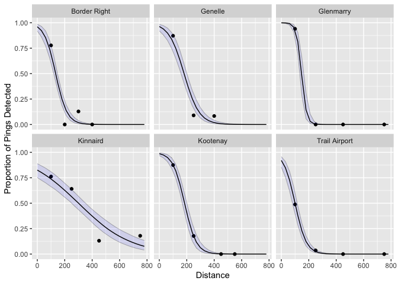

<!-- README.md is generated from README.Rmd. Please edit that file -->

# detrange

## Introduction

#### Detection Range and Detection Efficiency

`detrange` estimates detection range (DR) from multiple stations within
a passive acoustic telemetry array using range testing data collected in
the field. DR is defined by Kessel et al. (2014) as

> “… the relationship between detection probability and the distance
> between the receiver and tag…presented graphically in the form of a
> logistic curve of detection probability.”

Given a modeled DR, it is possible to estimate the distance at which a
target detection efficiency (DE) occurs. DE is defined by Brownscombe et
al (2019) as

> “\[t\]he number of acoustic transmitter detections effectively logged
> by an acoustic receiver in a given time period, expressed as a
> percentage (or proportion) of total potential detections based on
> transmission rate.”

Following recommendations from Brownscombe et al (2019) and Huveneers et
al. (2016), it can be useful to estimate the midpoint of the DR
(i.e. distance at 50% DE) in order to place sentinel tags at a sample of
receivers to measure variation in DE over time.

#### The modelling approach

Under the hood, `detrange` uses JAGS software and the
[rjags](https://cran.r-project.org/web/packages/rjags/rjags.pdf) R
package to implement a Bayesian generalized linear model with logit link
and binomial response distribution. If there are 5 or more stations, the
model is fit as a generalized linear mixed-effects model with random
intercept and slope for each Station. Otherwise, Station is treated as a
fixed effect.

A benefit of using a Bayesian approach is that uncertainty can be
quantifed for estimates of the distance at which a specified DE occurs.
In Bayesian lingo, the uncertainty of this derived parameter can be
estimated with the posterior distributions of other parameters in the
model.

Another benefit is the ability to incorporate prior information. By
default, the priors used in the model are non-informative. However, the
user may set custom priors, e.g., if prior information about realistic
detection range in a given system is known or if data is limited.

## Demonstration

### Data

`detrange` expects data typical of detection range testing. Mandatory
columns include:

-   `Station` (factor)  
-   `Distance` (numeric)  
-   `Detects` (integer)  
-   `Pings` (integer)

`Pings` is the expected number of detections and `Detects` is the
observed number of detections over the duration of the range testing
time period at a given distance. An example dataset `range_test` is
included for reference.

``` r
library(detrange)
detrange::range_obs
#> # A tibble: 42 × 4
#>    Distance Pings Detects Station 
#>       <dbl> <int>   <int> <fct>   
#>  1       50    51      50 Station1
#>  2      155    57      45 Station2
#>  3      275    51      10 Station3
#>  4      409    50       4 Station4
#>  5      564    56       0 Station5
#>  6      659    57      33 Station6
#>  7      782    59       0 Station1
#>  8       13    59      58 Station2
#>  9      146    51      42 Station3
#> 10      264    58      38 Station4
#> # … with 32 more rows
```

### Analysis

Fit a model

``` r
# adjust the `nthin` argument to improve convergence.
fit <- dr_fit(detrange::range_obs)
#> Registered S3 method overwritten by 'mcmcr':
#>   method               from 
#>   as.mcmc.list.mcarray rjags
```

The returned object has class `drfit`. A number of generic methods are
defined, including `glance`, `tidy`, `coef`, `augment`, `summary`,
`estimates`, `autoplot`, and `predict`.

``` r
tidy(fit, conf_level = 0.89)
#> # A tibble: 3 × 6
#>   term             estimate    lower   upper svalue description                 
#>   <term>              <dbl>    <dbl>   <dbl>  <dbl> <chr>                       
#> 1 bDistance        -0.0156  -0.0218  -0.0104   11.6 Effect of distance on logit…
#> 2 bIntercept        4.78     4.44     5.16     11.6 Intercept of logit(`eDetect…
#> 3 sDistanceStation  0.00694  0.00412  0.0144   11.6 Standard deviation of `bDis…
```

Predict distance(s) at target levels of detection efficiency

``` r
predicted_dist <- dr_predict_distance(fit, de = c(0.5, 0.8))
head(predicted_dist)
#>    Station  de estimate    lower    upper   svalue
#> 1 Station1 0.5 390.1591 365.9360 414.9143 11.55123
#> 7 Station1 0.8 278.1292 255.2679 300.1251 11.55123
#> 2 Station2 0.5 247.0141 227.3975 267.8640 11.55123
#> 8 Station2 0.8 176.7456 160.1723 192.8687 11.55123
#> 3 Station3 0.5 219.1298 200.8481 239.3193 11.55123
#> 9 Station3 0.8 156.9741 141.5989 173.4617 11.55123
```

Predict detection efficiency at distance(s)

``` r
predicted_de <- dr_predict_de(fit, distance = seq(0, 1000, 50)) 
head(predicted_de)
#>     Station Distance  estimate     lower     upper   svalue
#> 1  Station1        0 0.9916523 0.9874795 0.9947832 11.55123
#> 7  Station1       50 0.9845822 0.9776997 0.9897999 11.55123
#> 13 Station1      100 0.9717054 0.9607739 0.9802212 11.55123
#> 19 Station1      150 0.9486291 0.9312498 0.9625162 11.55123
#> 25 Station1      200 0.9085519 0.8810815 0.9304842 11.55123
#> 31 Station1      250 0.8424952 0.8014641 0.8759805 11.55123
```

Plot results using custom geoms

``` r
library(ggplot2)
ggplot(data = detrange::range_obs) +
  geom_dr_predicted(data = predicted_de, aes(x = Distance, estimate = estimate, 
                                             lower = lower, upper = upper)) + 
  geom_dr_observed(aes(x = Distance, detects = Detects, pings = Pings), size = 1) + 
  facet_wrap(~Station)
```

<!-- -->

### How to do more

The output of `dr_fit()` is a list with 3 elements:  
1. `fit$model` - the model object of class `jags` created by
`rjags::jags.model()`  
1. `fit$samples` - the MCMC samples generated
from`rjags::jags.samples()` converted to `mcmcr` class  
1. `fit$data` - the detection range data provided

These are the raw materials for any further exploration or analysis. For
example, view trace and density plots with `plot(fit$samples)`.

See [mcmcr](https://github.com/poissonconsulting/mcmcr) and
[mcmcderive](https://github.com/poissonconsulting/mcmcderive) for
working with `mcmcr` objects, or convert samples to an object of class
`mcmc.list`, e,g, with `coda::as.mcmc.list` for working with the
[coda](https://github.com/cran/coda) R package.

## Code of Conduct

Please note that the detrange project is released with a [Contributor
Code of
Conduct](https://contributor-covenant.org/version/2/0/CODE_OF_CONDUCT.html).
By contributing to this project, you agree to abide by its terms.

## Installation

Install the development version from [GitHub](https://github.com/) with:

``` r
# install.packages("devtools")
devtools::install_github("Freshwater-Fish-Ecology-Laboratory/detrange")
```
