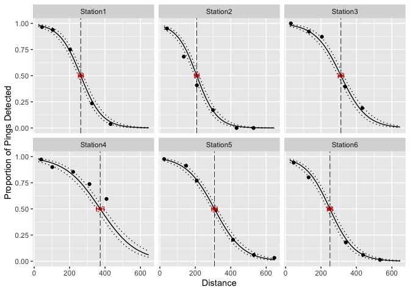

<!-- README.md is generated from README.Rmd. Please edit that file -->

# detrange

<!-- badges: start -->
<!-- badges: end -->

## Introduction

`detrange` estimates detection range from multiple stations within a
passive acoustic telemetry array. We use the definition of detection
range from Kessel et al. (2014):

> “… the relationship between detection probability and the distance
> between the receiver and tag. This can be presented graphically in the
> form of a logistic curve of detection probability, derived from the
> results of detection range testing in the field.”

Given the detection range, `detrange` also estimates the distance (wth
confidence intervals) at which a specified level of detection efficiency
is achieved. Typically, we are interested in the midpoint of the
detection range (i.e. distance at which 50% of pings are detected).

Under the hood, `detrange` uses a Bayesian mixed-effects logistic linear
regression model. Station is treated as a random effect (slope and
intercept) and Distance is the sole covariate.

## Demonstration

### Data

`detrange` expects data typical of detection range testing. These data
must include columns:

-   `Station` (factor)  
-   `Distance` (numeric)  
-   `Detects` (integer)  
-   `Pings` (integer)

`Pings` is the expected number of detections. An example dataset
`range_test` is included for reference.

``` r
library(detrange)
#> Loading required package: mbr
#> Registered S3 method overwritten by 'mbr':
#>   method         from
#>   pars.character term
#> Loading required package: jmbr

### view example dataset
data <- range_test
data
#> # A tibble: 34 × 4
#>    Station  Distance Detects Pings
#>    <fct>       <dbl>   <int> <int>
#>  1 Station1       44     109   113
#>  2 Station1      105     135   144
#>  3 Station1      203      90   120
#>  4 Station1      326      29   123
#>  5 Station1      431       5   133
#>  6 Station2       40     117   123
#>  7 Station2      135      73   107
#>  8 Station2      209      31    76
#>  9 Station2      300      25   146
#> 10 Station2      433       0   113
#> # … with 24 more rows
```

### Analysis

To estimate detection range, use `dr_analyse()`. The `priors` argument
allows the user to change the default priors and `nthin` can be adjusted
to improve model convergence.

``` r
analysis <- dr_analyse(data, nthin = 1L)
#> Registered S3 method overwritten by 'rjags':
#>   method               from 
#>   as.mcmc.list.mcarray mcmcr
#> # A tibble: 1 × 8
#>       n     K nchains niters nthin   ess  rhat converged
#>   <int> <int>   <int>  <int> <int> <int> <dbl> <lgl>    
#> 1    34     4       3   1000     1   150  1.05 FALSE
```

The output of `dr_analyse()` is an object of class `mbr`. It can be
manipulated using any functions within the [mbr
package](https://github.com/poissonconsulting/mbr). For convenience,
`detrange` provides some functions to summarise/visualise the analysis.

``` r
### plot predicted values
dr_plot_predicted(analysis)
```

<!-- -->

``` r
### get midpoint estimates
dr_analysis_midpoint(analysis)
#> # A tibble: 6 × 5
#>   Station  estimate lower upper svalue
#>   <fct>       <dbl> <dbl> <dbl>  <dbl>
#> 1 Station1     263.  249.  277.   11.6
#> 2 Station2     208.  195.  221.   11.6
#> 3 Station3     313.  298.  328.   11.6
#> 4 Station4     373.  353.  394.   11.6
#> 5 Station5     308.  294.  324.   11.6
#> 6 Station6     250.  236.  265.   11.6
```

``` r
### coefficient table
dr_analysis_coef(analysis)
#> # A tibble: 4 × 5
#>   term              estimate    lower  upper svalue
#>   <term>               <dbl>    <dbl>  <dbl>  <dbl>
#> 1 bIntercept           3.92    2.94     4.44   11.6
#> 2 bMidpoint          286.    273.     299.     11.6
#> 3 sInterceptStation    0.499   0.0932   1.54   11.6
#> 4 sMidpointStation    15.9    13.7     18.3    11.6
```

## Code of Conduct

Please note that the detrange project is released with a [Contributor
Code of
Conduct](https://contributor-covenant.org/version/2/0/CODE_OF_CONDUCT.html).
By contributing to this project, you agree to abide by its terms.

## Installation

Install the development version from [GitHub](https://github.com/) with:

``` r
# install.packages("devtools")
devtools::install_github("Freshwater-Fish-Ecology-Laboratory/detrange")
```
