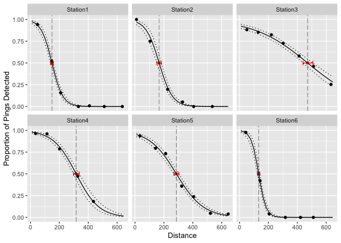

<!-- README.md is generated from README.Rmd. Please edit that file -->

# detrange

<!-- badges: start -->
<!-- badges: end -->

## Introduction

`detrange` estimates detection range of receivers within passive
acoustic telemetry arrays. Under the hood is a Bayesian mixed-effects
logistic linear regression model, where each station has a random
intercept and slope.

## Demonstration

### Range test data

Range test data must include columns `Station`, `Distance`, `Detects`
and `Pings`.

``` r
library(detrange)
library(mbr)
#> Registered S3 method overwritten by 'mbr':
#>   method         from
#>   pars.character term
library(jmbr)

data <- detrange::range_test
data
#> # A tibble: 34 × 4
#>    Station  Distance Detects Pings
#>    <fct>       <dbl>   <int> <int>
#>  1 Station1       44     109   113
#>  2 Station1      105     135   144
#>  3 Station1      203      90   120
#>  4 Station1      326      29   123
#>  5 Station1      431       5   133
#>  6 Station2       40     117   123
#>  7 Station2      135      73   107
#>  8 Station2      209      31    76
#>  9 Station2      300      25   146
#> 10 Station2      433       0   113
#> # … with 24 more rows
dr_plot_observed(data)
```

<!-- -->

### Analysis

Model the detection range with `dr_analyse`.

``` r
analysis <- detrange::dr_analyse(data, nthin = 1L)
#> Registered S3 method overwritten by 'rjags':
#>   method               from 
#>   as.mcmc.list.mcarray mcmcr
#> # A tibble: 1 × 8
#>       n     K nchains niters nthin   ess  rhat converged
#>   <int> <int>   <int>  <int> <int> <int> <dbl> <lgl>    
#> 1    34     4       3   1000     1   138  1.06 FALSE

### coefficient table
dr_analysis_coef(analysis)
#> # A tibble: 4 × 5
#>   term              estimate    lower  upper svalue
#>   <term>               <dbl>    <dbl>  <dbl>  <dbl>
#> 1 bIntercept           3.94    3.39     4.54   11.6
#> 2 bMidpoint          287.    273.     301.     11.6
#> 3 sInterceptStation    0.470   0.0862   1.30   11.6
#> 4 sMidpointStation    15.9    13.8     18.1    11.6

### get midpoint estimates
dr_analysis_midpoint(analysis)
#> # A tibble: 6 × 5
#>   Station  estimate lower upper svalue
#>   <fct>       <dbl> <dbl> <dbl>  <dbl>
#> 1 Station1     263.  250.  276.   11.6
#> 2 Station2     208.  195.  220.   11.6
#> 3 Station3     313.  297.  329.   11.6
#> 4 Station4     373.  354.  395.   11.6
#> 5 Station5     309.  293.  323.   11.6
#> 6 Station6     251.  236.  265.   11.6
```

### Plot

Plot predicted detection range, midpoints and confidence intervals.

``` r
### plot predicted values
dr_plot_predicted(analysis)
```

<!-- -->

## Code of Conduct

Please note that the detrange project is released with a [Contributor
Code of
Conduct](https://contributor-covenant.org/version/2/0/CODE_OF_CONDUCT.html).
By contributing to this project, you agree to abide by its terms.

## Installation

Install the development version from [GitHub](https://github.com/) with:

``` r
# install.packages("devtools")
devtools::install_github("Freshwater-Fish-Ecology-Laboratory/detrange")
```
